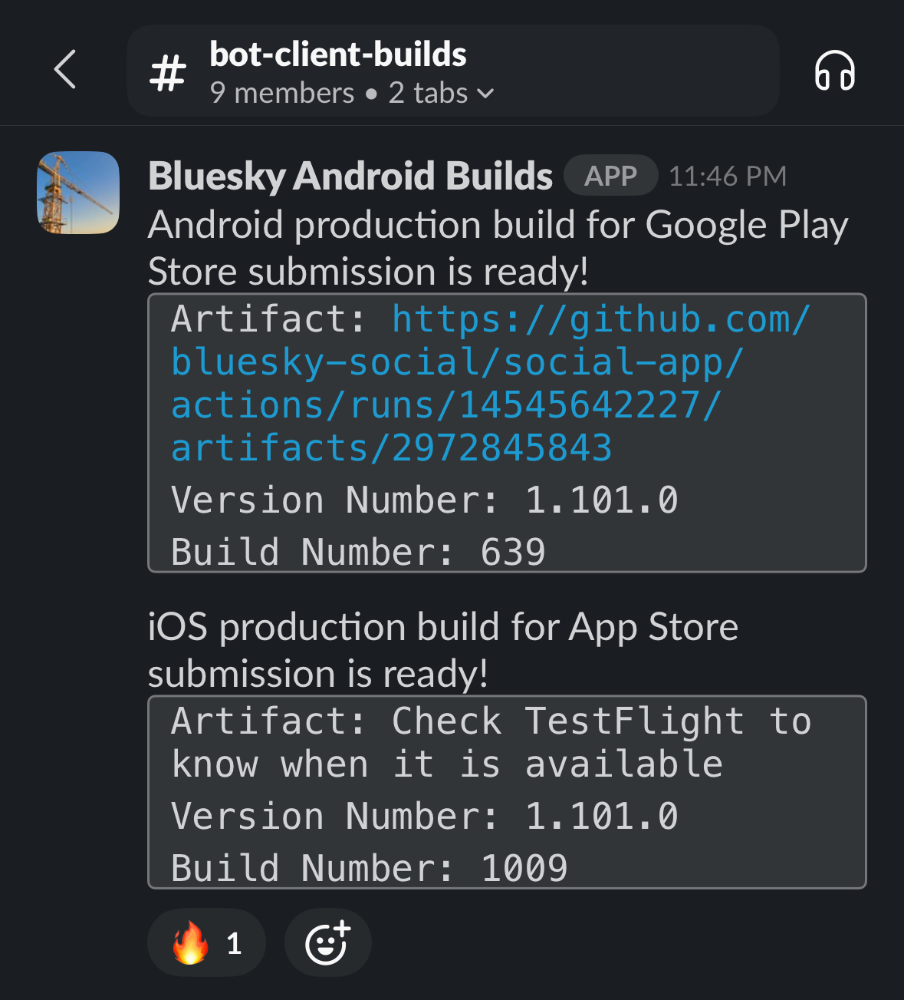
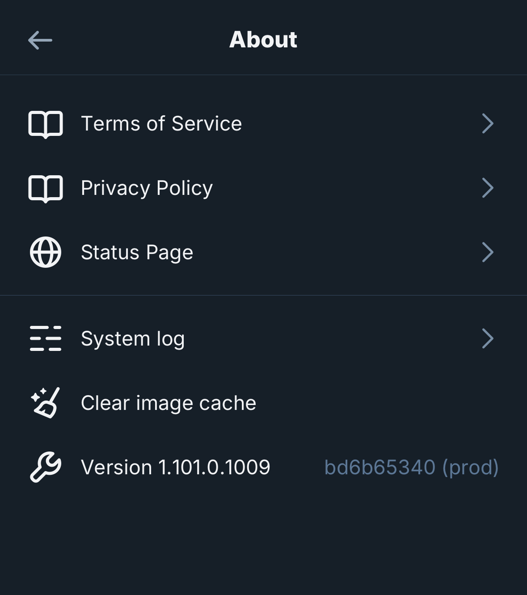
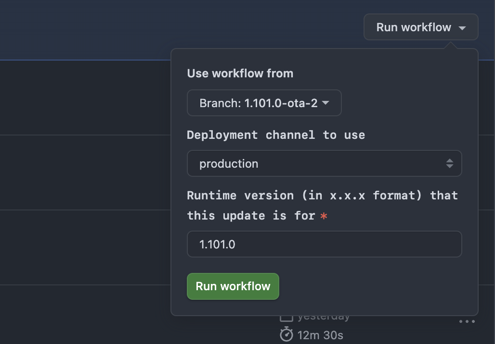
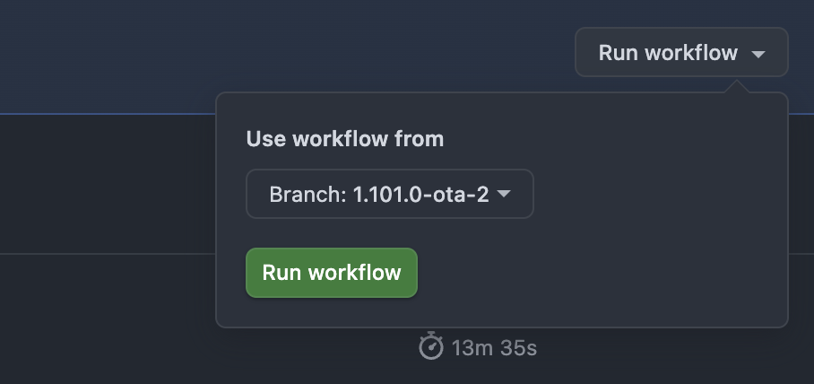
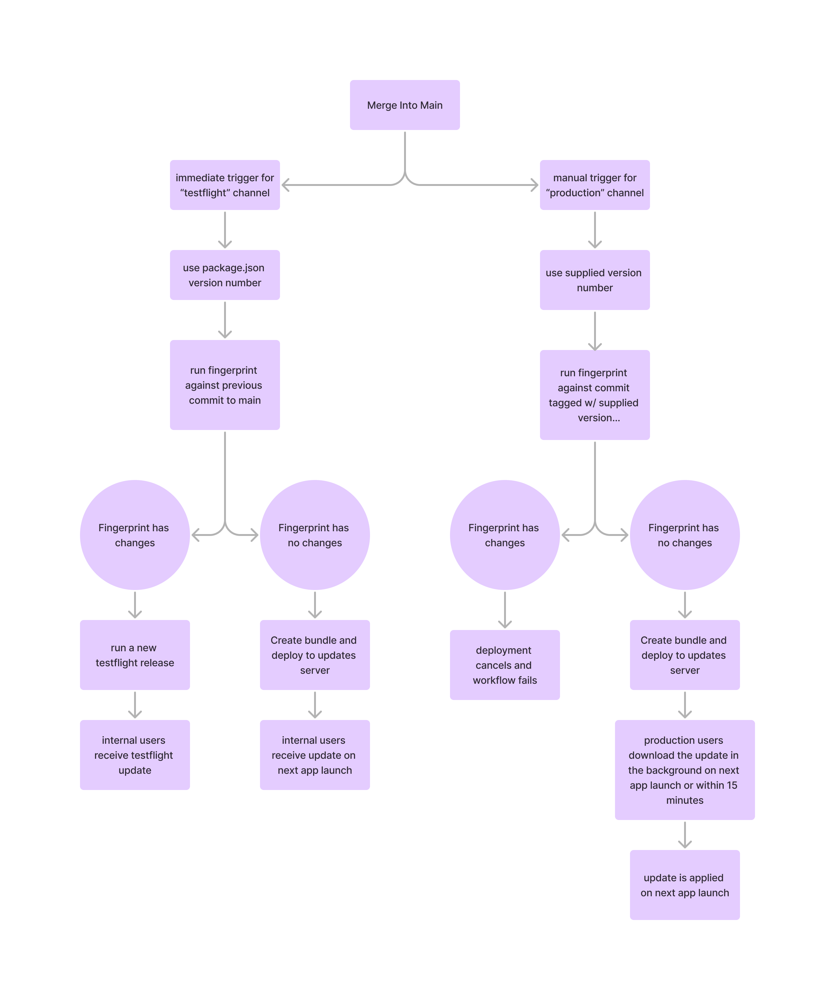

# OTA Deployments

## Automatic internal OTAs

OTA deployments to TestFlight/APK installs happen automatically upon all merges
into main. In cases where the fingerprint diff shows incompatible native
changes, a new client build will automatically be ran and deployed to TestFlight
(iOS) or delivered in Slack (Android).

## Production OTAs

Production OTAs can only update the JavaScript bundle. Changes to native modules
must be done as a full release cycle through the app stores.

> [!TIP]
> If you're using a TestFlight build, in order to reference the correct build
> number and to verify the success of an OTA, you will need to delete the
> TestFlight app itself, delete the Bluesky app entirely, and re-install from
> the App Store.

### 1. Find the build numbers

Find the latest production build numbers for iOS and Android in Slack. These are
spit out into `#bot-client-builds` after each release. You can also find this
information under the `About` section in app settings.

| Slack | In app |
| ----- | ------ |
|  |  |

### 2. Ensure the release is tagged

You need to ensure that the latest release was properly tagged using the format
`1.X.0`. If the commit is not properly tagged, then the OTA deployment will
simply fail since the GitHub Action will not be able to find a commit to
fingerprint and diff against.

### 3. Create an OTA branch

Create a branch based off the last commit that was deployed in the most recent
release. This could be the commit that was tagged `1.x.0`, or a later commit,
but it **needs to be the tip of the latest production release** in any case.
Double check yourself by ensuring that the `version` in `package.json` matches
what's in the latest release.

This new OTA branch should follow the format `1.X.0-ota-1`. If one or more OTAs
have already been deployed for this release, incremement the branch name e.g.
`1.x.0-ota-2`.

### 4. Add commits to the OTA branch

Cherry pick in the commits that need to be deployed on top of the most recent
release or OTA.

### 5. Manually set build numbers

Log in to the EAS CLI with `eas login` and manually set the build numbers to the
values you found in **Step 1**.

```sh
> npx eas build:version:set -p ios
>
> Project @blueskysocial/bluesky with bundle identifier "xyz.blueskyweb.app" is configured with buildNumber 1011.
> ✔ What version would you like to set? … 1009
>
> npx eas build:version:set -p android
>
> Project @blueskysocial/bluesky with application ID "xyz.blueskyweb.app" is configured with versionCode 641.
> ✔ What version would you like to set? … 639  
```

👉 **Save the previous values,** in this case `1011` and `641`, so you can reset
them after the OTA completes.

### 6. Run the GitHub actions
You'll need to run two separate actions: one to deploy the iOS/Android OTA
itself, and one to build the web Docker container.

**For the iOS/Android OTA,** head to [Actions > Bundle and Deploy EAS
Update](https://github.com/bluesky-social/social-app/actions/workflows/bundle-deploy-eas-update.yml)
and run the action.

| Steps |     |
| ----- | --- |
| Select your OTA branch `1.x.0-ota-x`, select `production` in the dropdown, enter the git tag of the latest release `1.x.0`, and click "Run workflow"  |  |

> [!NOTE]
> If you do enter an incorrect version here, the deployment will either:
> - Fail, because the action cannot find a commit with your misentered version
> - Succeed, but with no users receiving the update. This is because the version
>   you entered will not properly correlate to a _build number_ as well, so no
>   clients in the wild will be able to receive the update.

**For web,** head to [Actions >
build-and-push-bskyweb-aws](https://github.com/bluesky-social/social-app/actions/workflows/build-and-push-bskyweb-aws.yaml)
and run the action.

| Steps |     |
| ----- | --- |
| Select your OTA branch `1.x.0-ota-x` and click "Run workflow" |  |

### 7. Deploy web

Once the web Docker container build finishes, go to your `1.x.0-ota-x` branch,
copy the most recent commit hash. Post this hash in `#ops-deploys` and request
someone with web deploy access deploy the built container.

### 8. Confirm successful deployment

In about five minutes, the new deployment should be deployed and devices will
begin downloading and installing in the background.

To confirm this, as mentioned above, you must completely clear the TestFlight
build from your device and re-install from the App Store. Then, you'll need to:
- Launch the app (or quit and reopen) and wait ~15s for the download to complete
- Quit and reopen the app
- Check the `Settings > About` page and confirm the has matches the most recent has on your OTA branch

### 9. Reset build numbers

Grab the build numbers you saved in **Step 5** and reverse the EAS CLI commands
to reset the build numbers.

```sh
> npx eas build:version:set -p ios
>
> Project @blueskysocial/bluesky with bundle identifier "xyz.blueskyweb.app" is configured with buildNumber 1009.
> ✔ What version would you like to set? … 1011
>
> npx eas build:version:set -p android
>
> Project @blueskysocial/bluesky with application ID "xyz.blueskyweb.app" is configured with versionCode 639.
> ✔ What version would you like to set? … 641
```

## Overview diagram


