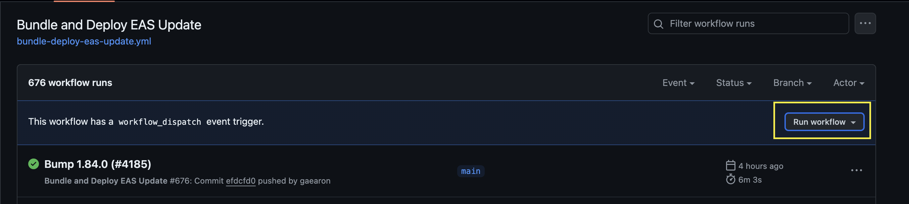
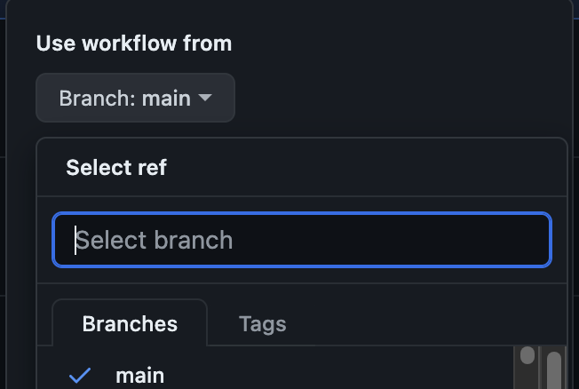
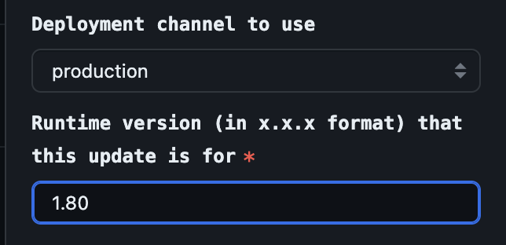

# OTA Deployments

## Overview

## Internal Deployments

Internal OTA deployments should be performed automatically upon all merges into main. In cases where the fingerprint
diff results in incompatible native changes, a new client build will automatically be ran and deployed to TestFlight 
(iOS) or delivered in Slack (Android).

## Production Deployments

### Prerequisites

- Remove any internal client from your device and download the client from the App Store/Google Play. This will help for 
testing as well as retrieving the build number.
- You should have signed in to EAS locally through npx eas login. You will need to modify the build number in a 
subsequent step.
- Identify the build number of the production app you want to deploy an update for. iOS and Android build numbers are 
divergent, so you will need to find both

  

- Ensure that the commit the initial client was cut from is properly tagged in git. The tag should be in the format of 1.X.0
  - Note: If the commit is not properly tagged, then the OTA deployment will simply fail since the GitHub Action will 
  not be able to find a commit to fingerprint and diff against.

### Preparation

- Create a new branch from the git tag that the initial release was cut from if no OTA deployment has been made yet for this 
client. Name this branch `1.X.0-ota-1`
- If a deployment has been made previously for this release, increment the branch name, i.e. `1.x.0-ota-2`
- If necessary, cherry-pick the commit(s) that you wish to deploy
- Ensure that the package.json’s version field is set to the appropriate value. As long as used the correct git tag
to create your branch from, this should be properly set.

### Deployment

- Update the build number through EAS
    - Note: This isn’t strictly necessary, but having a step that takes you off of GitHub and into the terminal provides 
    a little “friction” to avoid fat fingering a release. Since there are legitimate reasons to just “click and deploy”
    for internal builds, I felt it useful to make sure it doesn’t accidentally become a prod deployment.
    - Set the build number to the appropriate build number found in the prerequisite steps. Again, this should be the 
    build number for the current production release you want to deploy for.
    - `npx eas build:version:set -p ios`
    - `npx eas build:version:set -p android`
- Run the deployment
  - Navigate to https://github.com/bluesky-social/social-app/actions/workflows/bundle-deploy-eas-update.yml
  - Select the “Run Workflow” dropdown
  
    
  
  - Select the branch for the deployment you are releasing.
  
    
  
  - Double check the branch selection.
  - Select the production channel
  - Enter the version for the client you are releasing to, i.e. 1.80.0
    - Note: If you do enter an incorrect version here, the deployment will either:
      - Fail because the action cannot find a commit with your misentered version
      - Succeed - but with no users receiving the update. This is because the version you entered will not properly 
      correlate to a _build number_ as well, so no clients in the wild will be able to receive the update.
  
        
  
  - Triple check the branch selection.
    - You selected the correct branch
    - You selected the "Production" channel
    - You entered the correct version in the format of `1.X.0`.
  - Press “Run Workflow”

In about five minutes, the new deployment should be available for download. To test:

- Remove the internal build of the app from your device
- Download the app from the App Store/Google Play
- Launch the app once and wait approximately 15 seconds
- Relaunch the app
- Check the Settings page and scroll to the bottom. The commit hash should now be the latest commit on your deployed branch.
